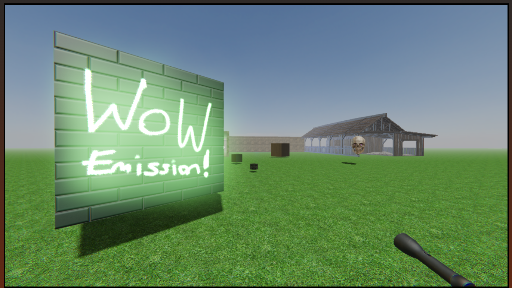
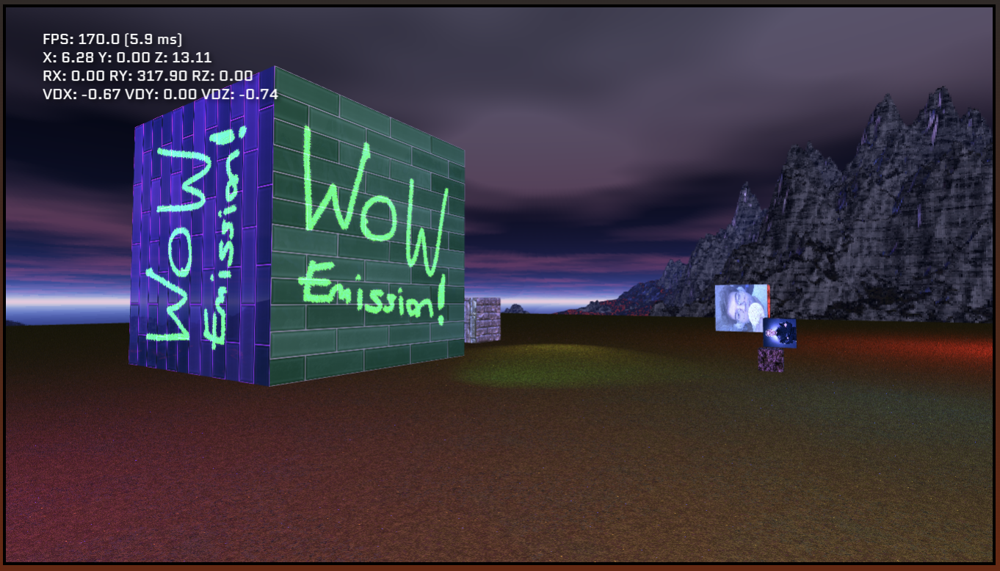
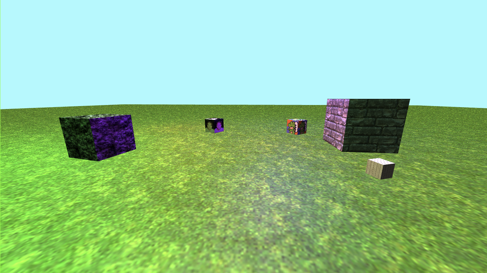
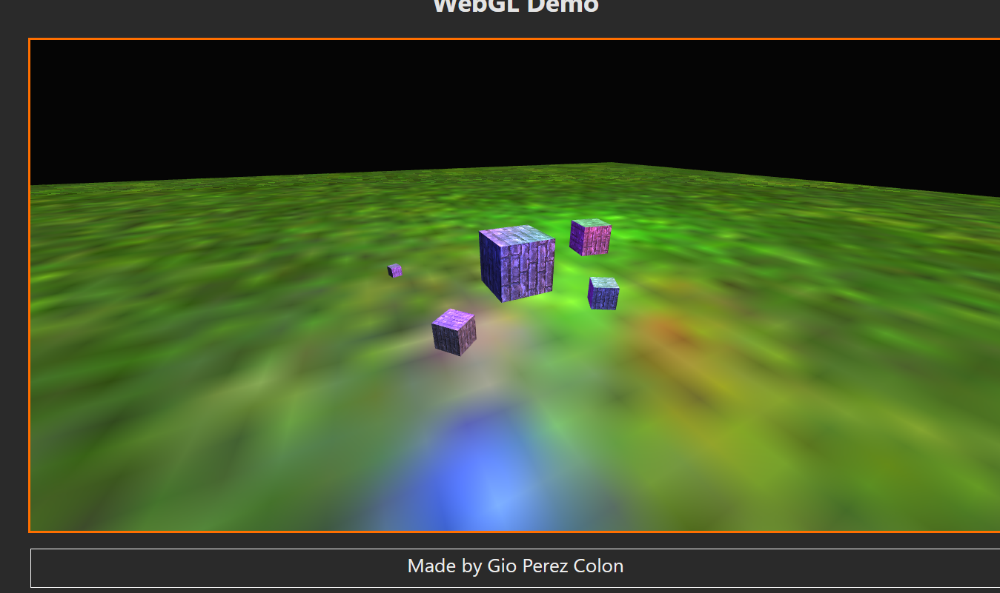
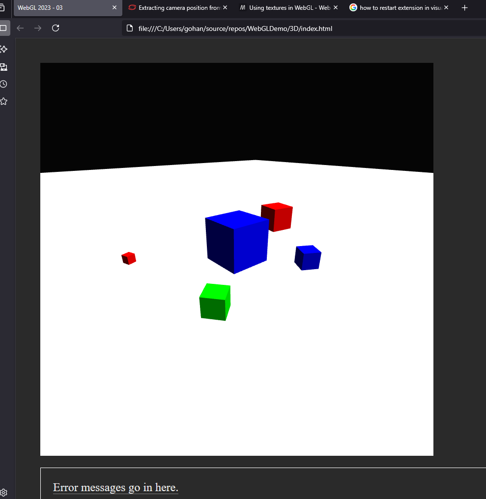

# Lava Engine (WebGL)

This is Lava Engine, an open source 3D game engine based on ECS architecture. It is currently being developed in WebGL with plans to recreate it as a C++ application.
I hope you enjoy! Click the image to try it out!

### Latest Update 9.24.25 (Click image to try out!)

### Update 9.9.25

### Update 8.18.25

### Update 8.17.25

### Update 8.16.25
